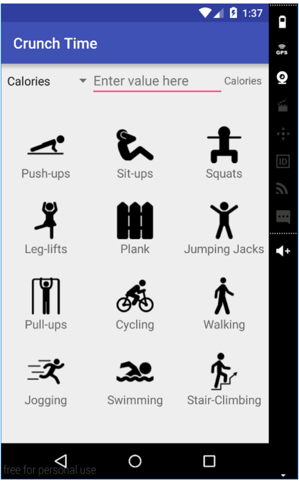
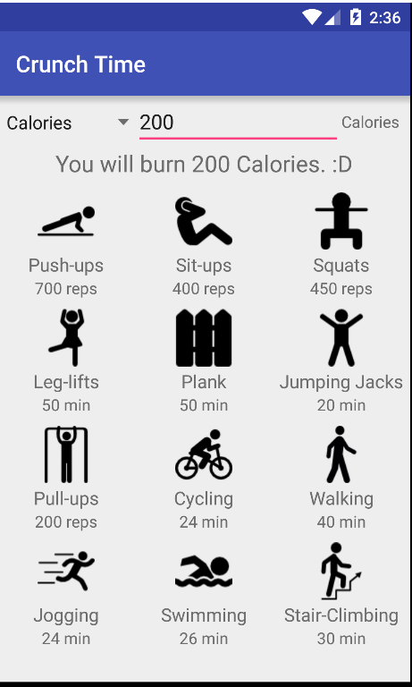
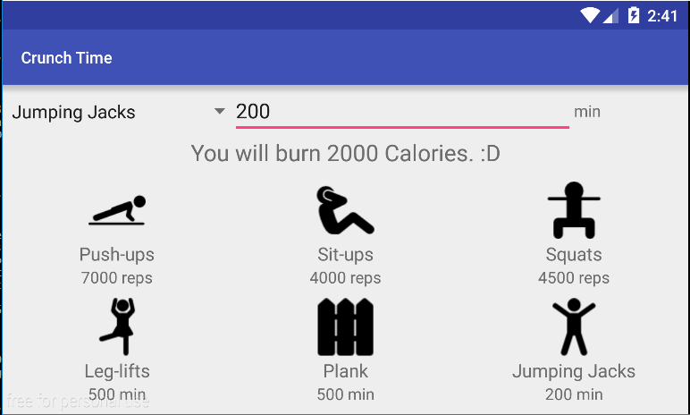

# PROG 01: Crunch Time

Crunch Time is a simple calorie burning conversion application that allows to see how many calories you burn by doing x amount of reps/min of certain exercises. You can also set a target calorie goal and see how many reps/min of exercises you need to do in order to achieve that goal. 

## Authors

Kyle Liang ([kyletliang@berkeley.edu](mailto:your_email@berkeley.edu))

## Demo Video

See [my demo video for Crunch Time!] (https://youtu.be/AKG2dHHEiDY)

## Screenshots

## Acknowledgments

* Hat tip to anyone who's code was used
* Icons from flaticon.com
* Any other support

